BreizhCTF 2023 - Un exchange poly 
==========================

### Challenge details

| Event                    | Challenge  | Category       | Points | Solves      |
|--------------------------|------------|----------------|--------|-------------|
| BreizhCTF 2023           | Un exchange poly | Reverse        | 500    | 2         |


Bonjour, si vous êtes là, c'est que vous êtes le meilleur de votre domaine. 
Vous allez devoir échanger avec un binaire plutôt sensible, vous allez devoir faire preuve de beaucoup de politesse ! 
Ne vous fiez pas à la première impression, bon courage.

### TL;DR

Il faut exécuter plusieurs fois le binaire pour avoir accès à toutes les étapes. A chaque nouvelle
étape du binaire se dernier se modifie sur le disque. Lors de chaque étape il faut entrer une 
chaîne de 27 caractères (le flag) et il sera checké à chaque fois des caractères différent.
Si on valide tous les caractères des différentes versions alors on récupère le flag. 

### Méthodologie

#### Premières informations 

On va récupérer les premières informations sur le binaire récupéré : 
```
$ file un_exchange_poly 
bin/un_exchange_poly: ELF 64-bit LSB executable, x86-64, version 1 (GNU/Linux), statically linked, BuildID[sha1]=a9e2220074472364aa3fa27c211569485464ea08, for GNU/Linux 4.4.0, stripped
```

C'est un binaire ELF 64 bits compilé statiquement et strippé. 

On va tenter de le lancer une première fois afin de voir ce que le challenge attend. 
```
$ ./un_exchange_poly
Usage : ./un_exchange_poly {FLAG}
```

Ah il demande une entrée utilisateur, on va donc retenter avec une entrée aléatoire. 
```
$ ./un_exchange_poly TEST
Bas pas très poly ça dit donc
```

Ok il est pas content apparemment, on va rapidement faire un petit coup de `strings` même si 
on en espère pas grand chose. En effet un binaire compilé statiquement va être bourré de 
strings supplémentaire.
```
strings -n 5 un_exchange_poly
...
LD_PRELOAD
LD_LIBRARY_PATH
Humm c'est quoi ce truc ?
Meh non
Encore ce truc mais c'est bizarre ?!
strace
ltrace
ida64
ida32
radare2
ghidra
cutter
iaito
LINES
COLUMNS
/proc/%i/status
/proc/%i/cmdline
Bon la
a commence
tre bizarre non ?
/proc/self/exe
/tmp/poly_generation
not_a_flag_dude!
popopopolylylyly
BZHCTF_radio_<3!
...
Usage : ./un_exchange_poly {FLAG}
Bas pas tr
s poly
a dit donc
Etape pass
Nop, pas la bonne
tape ?!
Bravo c'est gangn
 vous pouvez entrer le flag : %s
...
```

Après un peu de temps de recherche on tombe sur de vrais strings qui ont plus ou moins de sens.
En résumé on a des strings qui représentent : 
- des outils de RE 
- des variables d'environnements
- des strings permettant de récupérer des informations sur des processus en cours d'exécution
- une chaîne de victoire 
- des chaînes déjà croisées 

Bon il est temps de passer aux choses sérieuses et d'aller reverse un peu.  

#### Compréhension 

On va ouvrir le binaire afin de comprendre le comportement global du binaire. 

Dans le main après un renommage rapide on a le pseudo code suivant (partiel) : 

```c
if(argc != 2) {
        printf("USAGE");
        return;
}
if(strlen(argv[1]) != 27)
    return; 
```
Ok on comprend que c'était la partie qui faisait que l'on était jeté du binaire avec l'entrée 
`TEST`.
Allons vérifier le comportement du binaire avec une chaîne de 27 caractères.
```
./bin/un_exchange_poly AAAAAAAAAAAAAAAAAAAAAAAAAAA
Etape passée !
```
Ok apparemment on a réussi une étape ?! Super ! 

**Il est possible que le joueur ici ne réalise pas ce test et cela change toute la suite 
de la résolution du challenge. En effet le binaire ici s'est modifié sur le disque, si par 
exemple il est sur ida et qu'il ne reload pas le fichier d'input il ne s'en rendra pas compte**

**De toute manière il sera nécessaire de comprendre le comportement pour avancer, c'est pour 
cela que dans le wu on ne va pas remarque le changement du binaire et on va comprendre le 
comportement sans la modification.**

_Il y a des typos dans le binaire encore à ce moment mais elle seront corrigées_

On va donc continuer de comprendre le code du main : 
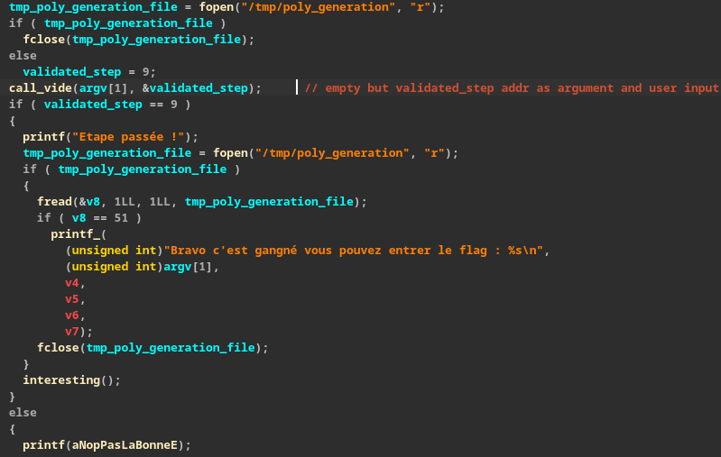

Le comportement est bizarre, mais on comprend que si le fichier `/tmp/poly_generation` existe
on le ferme, sinon `validated_step = 9`. Après on appel une fonction vide(_uniquement si pas ouvert 
après modification sur le disque_). Dans notre cas on est sur que le fichier existe pas donc 
on nous affiche bien `Etape passée !`. On va donc réouvrir le fichier mais ce dernier 
n'existe toujours pas donc va appeler la fonction `interesting`, après cela on quitte le binaire.

Allons voir ce que cette fonction fait. 
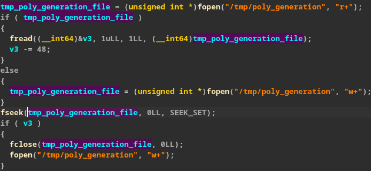

Comme précédemment si le fichier existe on va récupérer 1 caractère et enlever **48** à ce caractère.
On comprend avec le code qui suivra que c'est pour transforme le char `'1'` en entier `1`.
Si le fichier n'existe pas on va juste l'ouvrir en écriture/lecture. Ici `v3` sera renommé 
`poly_generation` pour la suite, cette variable est égale à zéro par défaut et dans le notre 
cas elle va rester à zéro. 

Ensuite il y a une grosse condition qui nous mène ici si `poly_generation == 0`: 
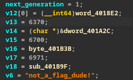

On a une association de valeures entières et d'offsets dans le binaire avec une string 
`"not_a_flag_dude"`. Par la suite on va se rendre compte que c'est une structure donc on 
va créer la structure à l'avance pour la lisibilité.

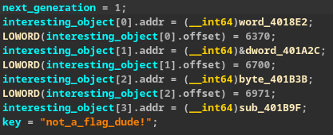

Après l'analyse des fonctions suivantes on arrive a renommer de cette façon. 
Cela va nous permettre de mieux comprendre les fonctions qui vont utiliser cette structure.


On comprend ici qu'il est calculé la taille des fonctions du tableau de structure `function_block_t`.
Il est intancié un buffer de la taille de cette fonction et copié le contenu de cette fonction 
dans le buffer (sur la heap). 
Ensuite la fonction suivante va être appelée: 

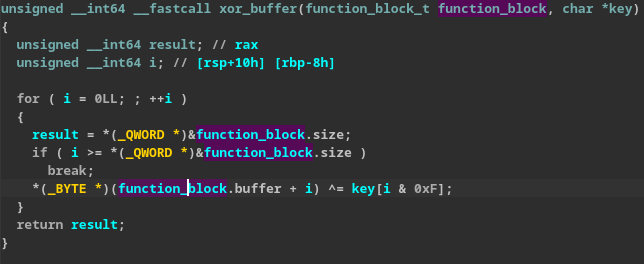

Ici le buffer sera xoré avec la clé récupérée précédemment (char by char).


Dans ce bloque de code on remarque qu'il est écrit dans `/tmp/poly_generation` le numéro de 
génération `+1`. Ce qui va modifier le comportement du binaire si on le relance ! 
On appele la fonction décrite précédemment. Ensuite il est récupéré le nom courant du binaire :

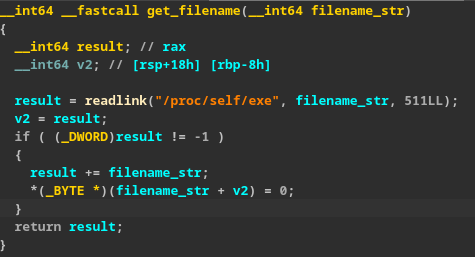

Ensuite on comprend qu'il est calculé la taille de notre fichier. 

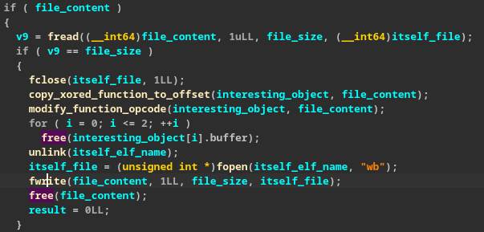

Il est copié le contenu du fichier dans le buffer alloué précédemment. Ensuite il est copié 
les opcodes des fonctions xorées. Après une modification des opcodes de la fonction 
que l'on pensait inutile a lieu. Le code modifié de cette fonction va permettre 
l'appel aux fonctions déchiffrées. Le fichier sur le disque est "supprimé" et le contenu 
du buffer modifié est écrit dans un fichier avec le même emplacement. 

Tout cela nous permet de comprendre qu'après chaque exécution réussie le binaire va muter 
en une nouvelle version avec des appels différents à certaines fonction. 

Après exécution on peut observer le code suivant dans la fonction au préalablement vide : 

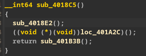

Chacune de ces fonctions va vérifier 3 caractères du flag. Il suffit donc de trouver les 9 bons 
caractères de la génération courante du binaire pour passer à l'étape suivante. 
A la fin si on a trouver tous les bons caractères le flag entré en paramètre est affiché.


#### Résolution 

Il s'agit donc maintenant de résoudra chaque fonction une part une. 

Ici sera explicité toutes les fonctions :

Les fonctions de la génération 1 :

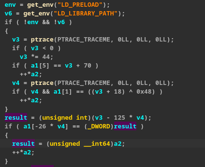

Cette fonction voit son comportement modifiée si un débuggueur est présent ou si les variables 
d'environnements `LD_PRELOAD` et `LD_LIBRARY_PATH`.

Le comportement normal de la fonction est le suivant : 
```
flag[1] = 'Z' 
flag[5] = 'F'
flag[26] = '}'
```

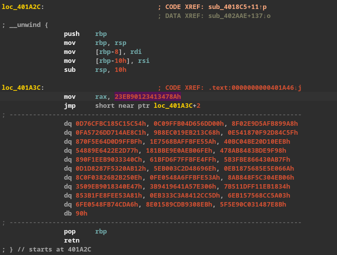

La fonction `1_2` implémente de l'anti-désassemblage après une rapide passe on obtient quelque chose 
de lisible qui donne les caractères suivants : 
```
flag[12] = '3'
flag[14] = '3'
flag[19] = '3'
```

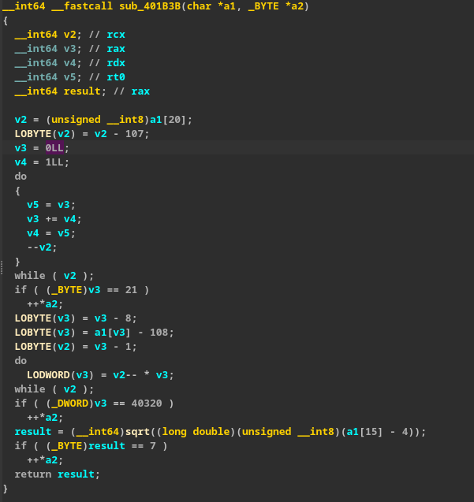

Cette fonction va réaliser plusieurs calculs spécifiques `Fibonacci`, `Factorielle`, `Square root`.
Ici il est plus simple de se rapprocher de l'assembleur afin de comprendre le code de la fonction.
```
flag[13] = 't'
flag[15] = '5'
flag[20] = 's'
```

Les fonctions de la génération 2 : 

Dans la première fonction de la génération 2, il est implémenté de l'anti-debug à l'aide 
de call ptrace spécifique. Selon les résultats de ces call le comportement sera modifié.    
```
flag[0] = 'B'
flag[2] = 'H'
flag[3] = 'C'
```

Dans la fonction qui suit il est implémenté de l'anti-désassemblage à base de unconditionnal 
jump. De plus il y a des instructions assembleurs peu communes.
Après un rapide patch on peut récupérer les caractères suivants :
```
flag[10] = '5'
flag[16] = '_'
flag[25] = 'Y'
```

Dans la dernière fonction de cette génération, des opérations spécifiques sont réalisées sur 
les caractères entrés. Cela est représenté par le code suivant : 

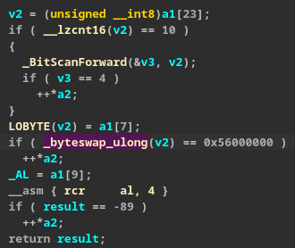
```
flag[7] = 'V'
flag[9] = 'u'
flag[23] = '0'
```

Les fonctions de la génération 3 : 

La première fonction implémente aussi de l'anti-debug qui permet de modifier le comportement 
si un débuggueur est détecté. Les caractères cherckés sont les suivants.
```
flag[11] = '_'
flag[17] = 't'
flag[21] = '_'
```

La deuxième implémente du `Thwarting Stack-Frame` qui est facilement bypass. Après on peut 
voir les caractères checkés rapidement.

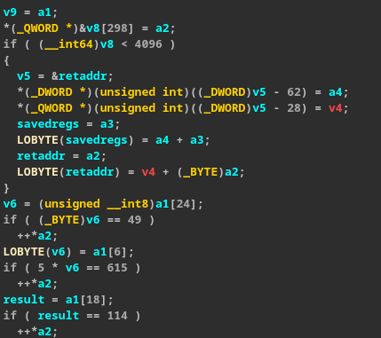
```
flag[6] = '{'
flag[18] = 'r'
flag[24] = '1'
```

La dernière fonction de ce challenge va réaliser des vérifications classiques et implémenter
des patterns assembleurs trouvable dans `xchg rax, rax`.

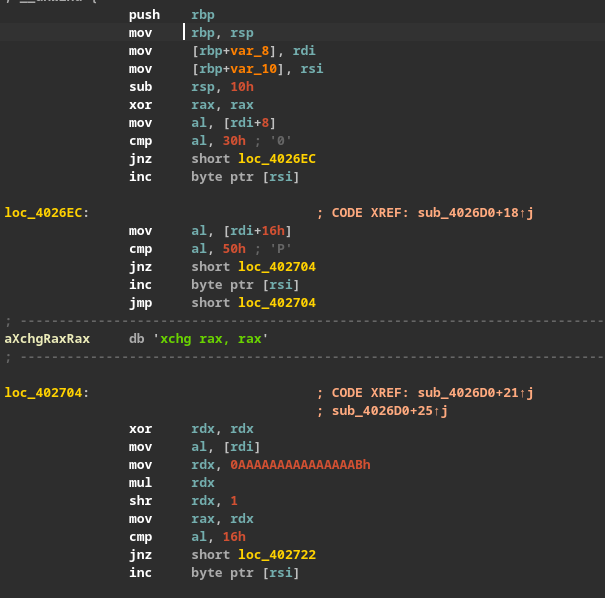
```
flag[8] = '0'
flag[4] = 'T'
flag[22] = 'P'
```

Après avoir rassemblé tous ces caractères cela nous donne le flag suivant : 
`BZHCTF{V0u5_3t35_tr3s_P01Y}`


